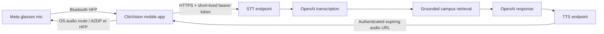

# ClioVision voice-pipeline security

## Data flow

For visual questions, the glasses camera sends one JPEG to the mobile app through Meta DAT. The app downsizes the image, sends it to the authenticated `/vision/identify` endpoint over HTTPS, and removes the temporary cached file after the request. The backend keeps the upload in memory and sends it to the configured vision provider; application code does not persist it.

The backend is the only component that holds the OpenAI API key. The phone receives a generated speech URL only after authenticating, and the URL contains a random identifier rather than a bearer token.

## Controls implemented

- Production requests are rejected unless the connection is HTTPS (directly or through a correctly configured TLS proxy).
- Web origins are allowlisted; native clients without an `Origin` header are supported.
- Helmet security headers, global rate limits, stricter authentication/voice limits, and a 64 KB JSON limit are enabled.
- A private enrollment code is compared with timing-safe equality.
- Access and refresh JWTs use HS256, fixed issuer/audience claims, unique token IDs, and separate token-kind claims.
- Access tokens expire after 15 minutes; refresh tokens expire after 7 days.
- Native refresh tokens are stored with Expo SecureStore using this-device-only, when-unlocked accessibility.
- Access tokens live in app memory. The enrollment code is never stored.
- Speech uploads are restricted to one supported audio file, held in memory, and capped at 10 MB.
- Visual uploads require an authenticated device, accept one JPEG or PNG, are held in memory, are capped at 4 MB, and are limited to 12 requests per minute.
- Visual matches are restricted to known campus-place IDs and rejected below the confidence threshold; descriptive facts are loaded from curated records after identification.
- Generated speech is held in memory for two minutes, scoped to the authenticated device, and returned with `no-store` headers.
- Raw audio, captured images, questions, answers, tokens, and enrollment codes are not intentionally logged or persisted by application code.
- Background recording is disabled in native configuration.

## Required production infrastructure

1. Terminate TLS at a trusted proxy/load balancer and pass a sanitized `X-Forwarded-Proto` header. Do not expose the Node port directly.
2. Set a unique high-entropy `CLIO_JWT_SECRET` and enrollment secret through a secrets manager, not a committed `.env` file.
3. Set `CLIO_ALLOWED_ORIGINS` to exact deployed web origins.
4. Redact authorization headers and request bodies in proxy/APM logs.
5. Apply vendor data-retention controls and publish a privacy notice for recorded speech and AI processing.
6. Rotate provider keys and pairing credentials on a defined schedule.

## Remaining work before a public launch

The current enrollment code is an MVP bootstrap mechanism. Before public distribution, replace it with user authentication plus one-time device enrollment, persisted token revocation, and Apple App Attest / Google Play Integrity validation. Add an encrypted database for device state and audit events, per-user authorization, abuse detection, and a deletion/export workflow.

The in-memory speech cache assumes one backend process. A horizontally scaled deployment should use an encrypted object store with per-device authorization and automatic expiry, or sticky routing with an equivalent secure cache.

Certificate pinning can reduce proxy risk but creates operational rotation hazards; evaluate it after the production host and certificate strategy are stable. Native Meta DAT integration and real-glasses audio route testing are also required before claiming hardware-level end-to-end assurance.
